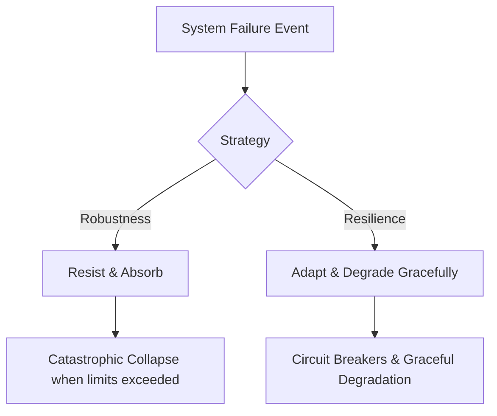

In the early days of Site Reliability Engineering (SRE), success was simple to define: keep the servers running. If the virtual machines were pingable, CPU utilization was under 80%, and the network was passing packets, we celebrated our "four nines" of uptime. 

But as software systems have grown increasingly complex, distributed, and user-centric, this traditional infrastructure-first model of reliability is no longer sufficient. Today, you can have a 100% healthy infrastructure according to traditional dashboards, while your end-users are experiencing a completely broken application. 

To thrive in a cloud-native world, we must move **beyond reliability** as a purely technical metric and start thinking about SRE in terms of user experience, adaptability, and business outcomes.

---

### The Trap of "Watermelon Metrics"

Many SRE teams suffer from what is known as the **"Watermelon Metric"** phenomenon: dashboards that are vibrant green on the outside (infrastructure monitoring showing 99.9% VM uptime), but deeply red on the inside (users unable to complete their purchases due to a silent API gateway failure).

Traditional monitoring focuses on *cause-based* alerting:
* Is CPU utilization high?
* Is this container out of memory?
* Is the database disk filling up?

While these metrics are useful for debugging, they don't answer the most critical question: **Can the user accomplish what they came to do?**

### Shifting to User-Centric SLIs and SLOs

To move beyond watermelon metrics, SREs must redefine their Service Level Indicators (SLIs) and Service Level Objectives (SLOs) around the user's journey rather than host-level statistics. 

Instead of measuring **"VM Uptime"**, measure **"Critical User Journeys (CUJs)"**:
* **The Checkout Flow:** What percentage of checkout attempts succeed in under 2.5 seconds?
* **The Search Function:** Are search results returning valid products, or is the page returning empty results due to an upstream caching timeout?
* **Authentication:** Can users log in successfully on their first attempt?

When your SLOs are built around user happiness, your error budget becomes a powerful tool. It stops being a metric of fear and starts representing the acceptable level of friction a user can tolerate before they abandon your platform.

---

### Robustness vs. Resilience

In engineering, we often conflate *robustness* with *resilience*, but they are fundamentally different concepts:

* **Robustness** is the ability of a system to resist failure. It's like a concrete dam—strong, solid, and built to withstand predictable forces. However, when the pressure exceeds its limits, it fails catastrophically.
* **Resilience** is the ability of a system to adapt to failure and degrade gracefully. It is more like a bamboo stalk—bending in the wind, absorbing the shock, and returning to its original state.

Moving beyond reliability means accepting that **failure is inevitable** in highly distributed systems. Instead of trying to build an unbreakable system (which is mathematically impossible and economically prohibitive), we should focus on:
1. **Circuit Breakers:** Tripping connections to failing downstream dependencies to prevent cascading failures.
2. **Graceful Degradation:** Showing cached or static content to users when dynamic services are unavailable.
3. **Load Shedding:** Rejecting non-essential requests (like recommendation engines) to preserve system capacity for critical transactions (like checkouts).

---

### Observability Over Monitoring

Classic monitoring tells you *when* a system is failing by testing predefined thresholds. But in highly distributed microservice architectures, systems fail in ways we could never have predicted. 

This is where **Observability** comes in. Observability isn't just about collecting "logs, metrics, and traces" (the three pillars); it's about having the rich, high-cardinality data necessary to ask questions about your system that you didn't know you'd need to ask beforehand.

When a single user in a specific region using a specific browser version experiences a checkout failure, traditional monitoring is blind to it. Observability allows you to slice and dice your system's telemetry in real-time, isolating the exact combination of variables causing the anomaly.

---

### SRE as an Accelerator, Not a Gatekeeper

For a long time, operations and SRE teams were seen as the "gatekeepers of stability." The mindset was: *to keep things stable, we must slow down changes.*

Modern SRE flips this script. The goal of SRE is to **increase developer velocity safely**. By automating post-mortems, defining clear error budgets, and implementing robust progressive delivery mechanisms (like canary deployments and feature flags), SREs empower product teams to ship code faster and with greater confidence.

Reliability is not the absence of change; it is the capability to change safely and rapidly.

### Conclusion: The New SRE Mandate

As SREs, our ultimate metric of success isn't how many nines we have on a dashboard. It is how well we support the business and protect the user experience. By shifting our focus from infrastructure health to user happiness, embracing resilience, and championing observability, we elevate reliability from a cost-center engineering task to a core business driver.

The next time you look at your dashboards, ask yourself: *Are we just measuring uptime, or are we truly delivering value?*
