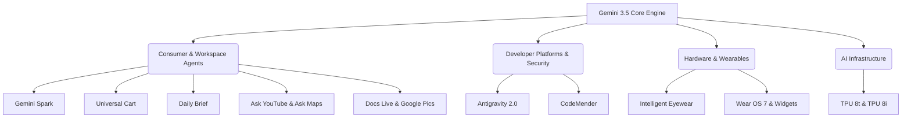

Every year, Google I/O serves as a compass for the tech industry, charting the course for the next generation of consumer experiences but this time it marked a massive paradigm shift. 

We have officially transitioned from the "Generative Era" of AI to the **"Agentic Era."**

Instead of just responding to prompts or summarizing search queries, Google's latest wave of technology centers on autonomous, proactive AI agents that can reason, orchestrate workflows, collaborate, and execute long-horizon digital tasks in the background.

Here is a comprehensive breakdown of every major tool and launch at Google I/O 2026:

---

### 1. Gemini 3.5 Flash  
  Gemini 3.5 Flash is the latest high-speed, lightweight model in the Gemini 3.5 series. It is built specifically for speed, low-latency responsiveness, and orchestrating complex "agentic" and coding workflows that require rapid, multi-step execution.
  * **Ultra-Fast Speed:** It operates up to four times faster than previous frontier models, making it ideal for real-time interactions.
  * **Native Integration:** Immediately rolled out as the default engine powering the Gemini App and the new AI Mode in Google Search.
  * **Optimized for Coding:** Features highly enhanced reasoning capabilities for programming and recursive troubleshooting tasks.

---

### 2. Gemini Spark 
  Gemini Spark is Google’s new "24/7 personal AI agent." It is designed to act as an autonomous digital assistant that proactively manages daily chores, schedules, and digital tasks without requiring direct supervision or keeping the user's browser active. 
  * **Persistent Cloud Execution:** Runs continuously on dedicated virtual machines in Google Cloud, meaning it can sort emails, flag calendar conflicts, and book appointments even when your phone or laptop is completely shut off.
  * **Proactive Orchestration:** Learns your habits and preferences to autonomously draft replies, organize documents, and handle digital errands.
  * **Exclusive Subscription Rollout:** Currently available to trusted testers and coming soon to Google AI Ultra subscribers ($100/month or included in the updated premium tiers).

---

### 3. Gemini Omni (and Gemini Omni Flash) 
  Gemini Omni is a new multimodal generative "world model" that treats video, audio, image, and text as native inputs and outputs. It is focused heavily on real-time, creative generative video creation and fluid editing.  
  * **Conversational Video Editing:** Features **Gemini Omni Flash**, allowing users to generate and modify video content simply by speaking to the model (e.g., "Add a warm lens flare," or "Change the car color to metallic blue").
  * **Seamless Multimodality:** Eliminates the latency of feeding inputs to separate models by natively processing high-fidelity video, speech, and text simultaneously.

---

### 4. Google Antigravity 2.0 
  Antigravity 2.0 is Google's new, agent-first developer platform. It is a comprehensive suite designed to help engineers build, monitor, orchestrate, and deploy parallel multi-agent systems and agentic workflows.  
  * **Standalone Desktop App:** A visual, state-of-the-art developer workspace to orchestrate multi-agent environments, track agent tasks in real-time, and run interactive simulations.
  * **Antigravity CLI & Python SDK:** Enables developers to build, test, and spin up agents programmatically directly from the command line.
  * **Model Context Protocol (MCP) Support:** Built-in standard protocol support, making it incredibly simple to securely connect agents to local databases, shell tools, and third-party APIs.
  * **Generative App Development:** Demonstration showcased the ability to construct complete apps and simple operating systems through natural language instructions.

---

### 5. CodeMender 
  CodeMender is an autonomous AI security and engineering agent built inside the Antigravity Agent Platform. It is used to automatically detect, analyze, patch, and rewrite critical vulnerabilities in codebases.  
  * **Self-Healing Codebases:** Autonomously scans local or remote code repositories for critical vulnerabilities.
  * **Automatic Patch Generation & Testing:** Not only finds security issues but automatically drafts code patches, runs unit tests to ensure no regressions, and submits pull requests for human review.

---

### 6. Ask YouTube 
  Ask YouTube is a new conversational search experience built into YouTube that allows users to query the actual content of videos to find specific answers without having to watch them all the way through.
  * **Time-Stamped Responses:** If you ask "How do I calibrate the focus ring in this video?", the AI answers the question in text and jumps you directly to the exact millisecond in the video where that step is shown.
  * **Conversational Dialogue:** Users can ask follow-up questions, summarize key takeaways of long-form podcasts, or extract ingredient lists from cooking videos.

---

### 7. Ask Maps 
  Ask Maps is a conversational, Gemini-powered assistant integrated directly within Google Maps. It allows users to query Google Maps using complex, scenario-based natural language to find location recommendations and plan itineraries without relying on restrictive keywords.  
  * **Scenario-Based Inquiries:** Solves complex real-world queries (e.g., "Where can I charge my EV, in the next 10 minutes, with a restaurant nearby that serves pasta?").
  * **Deep Personalization:** Accounts for your saved locations, travel patterns, and past preferences to offer highly tailored recommendations.

---

### 8. Google Pics
  Google Pics is a brand-new AI design and precision image-editing tool integrated directly into Google Workspace (Docs, Slides, Drive), powered by an on-device Gemini Nano Banana model.  
  * **Dynamic Canvas Editing:** Allows users to modify isolated components of an image (e.g., resizing or moving an object) while AI seamlessly fills in the background behind it.
  * **Workspace Productivity:** Enables office workers to design professional flyers, mockups, social media graphics, and translate texts embedded in visual assets on the fly.

---

### 9. Docs Live
  Docs Live is a voice-enabled, interactive collaboration tool integrated within Google Workspace (including Google Docs, Gmail, and Google Keep). It allows users to write, draft, edit, and organize documents hands-free via real-time conversational voice dialogue. 
  * **Real-Time Spoken Dictation & Structuring:** Converts spoken thoughts into beautifully structured, formatted outlines and paragraphs on the fly.
  * **Voice-Driven Editing:** Allows users to issue real-time verbal commands to refine drafts (e.g., "Change this paragraph's tone to be more professional," or "Insert a summary bullet list of these notes").
  * **Cross-Workspace Integration:** Seamlessly search and extract context from Gmail inboxes and Google Drive files entirely through natural spoken conversations.

---

### 10. Universal Cart
  Universal Cart is an agentic, unified shopping hub operating across Search, Gemini, YouTube, and Gmail. It allows users to shop, aggregate, compare, and check out items from multiple online retailers in one single checkout stream.
  * **Background Deal Tracking:** Constantly monitors prices, applies discount codes, flags restocks, and reports historical price drops for items in your cart.
  * **Universal Commerce Protocol (UCP):** A new standard that allows agents to securely complete purchases on behalf of users.

---

### 11. Daily Brief 
  Daily Brief is an intelligent personal dashboard powered by Gemini that automatically digests information from your digital life to give you a highly customized, actionable start to your day. 
  * **Multi-Source Triage:** Aggregates and synthesizes unread emails, upcoming calendar appointments, and outstanding tasks into one comprehensive briefing.
  * **Conversational Follow-ups:** Proactively suggests actions (e.g., "You have an email from Sarah asking to reschedule; would you like me to move your 2:00 PM calendar block?").

---

### 12. Wear OS 7 & Wear Widgets
  Wear OS 7 is the latest major operating system update for smartwatches, with a massive architectural upgrade centered on real-time widgets and on-device intelligence. 
  * **Wear Widgets:** Dynamic tiles that mirror active application states and phone-based information in real-time, rather than requiring you to open apps.
  * **Gemini Smart Engine:** Deep integration of Gemini to provide context-aware shortcuts and voice-driven agentic assistance directly on the wrist.

---

### 13. Google Intelligent Eyewear (Smart Glasses) 
  Developed in collaboration with Samsung, Warby Parker, and Gentle Monster, these are sleek, audio-first smart glasses designed to provide a highly private, hands-free spoken connection to Gemini on the go. 
  * **Audio-Focused Assistance:** Provides real-time spoken translations, directions, and reminders quietly in your ear, eliminating the need for bulky displays or constant phone-checking.
  * **Stylish Designs:** Built with leading fashion brands like Warby Parker to look like premium, everyday eyewear. Launching in Fall 2026.

---

### 14. TPU 8t & TPU 8i (Eighth-Generation Tensor Processing Units)  
  Google's custom-designed eighth-generation AI accelerator chips, split into two specialized workloads: **TPU 8t** for massive model training and **TPU 8i** for real-time model inference.  
  * **TPU 8t (Training Optimized):** Delivers nearly 3x the raw compute of previous generations, custom-built to scale training across over one million TPUs globally using JAX and Pathways to shrink frontier model training cycles from months to weeks.
  * **TPU 8i (Inference Optimized):** Specifically designed to power real-time agentic workloads, optimizing energy efficiency to deliver 2x higher performance-per-watt for low-latency, scalable AI application serving.

---

### 15. The Reimagined Search Box
  Billed as the "biggest upgrade to the Search box in 25 years," Google Search has evolved from a text-and-link query engine into a multi-input reasoning engine.  
  * **Rich Multi-Input:** Users can drag-and-drop text, images, files (such as spreadsheets), and even video files directly into the Search box to get instant, synthesized, intent-based answers.  
  * **Unified Desktop & Mobile Experience:** Fully merges AI Overviews and AI Mode into a single, seamless, interactive search stream.

---

### Conclusion: Welcome to the Future of Technology

Google I/O 2026 has set a bold course. The days of treating AI like a simple search bar or a writing prompt are fading. The agentic future is here, where AI operates as a collaborative partner, running in the background to handle the tedious work of software development, shopping, and organization.

*Which of these announcements are you most excited to try?*
